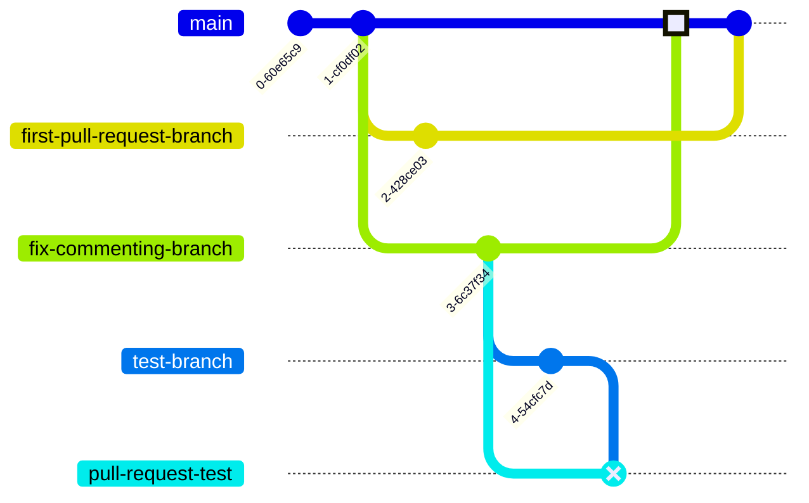

# Workflow Permissions

## `contents: read`

Generally speaking, check-spelling needs to be able to check out the repository with the source code.

The normal way to do that is with:

### Permissions

```yaml
permissions:
  contents: read
```

### Steps

```yaml
- uses: actions/checkout@...
```

or

```yaml
- uses: check-spelling/check-spelling@...
  with:
    checkout: 1
```

## `pull-requests: read`

In order to stop early when configured with [`suppress_push_for_open_pull_request`](Configuration#suppresspushforopenpullrequest),
check-spelling needs to be able to check for pull requests.

### Permissions

```yaml
permissions:
  pull-requests: read
```

## `actions: read`

In order to retrieve artifacts with [post_comment](Configuration#postcomment), check-spelling will need `actions: read`.

The normal way to do that is with:

### Permissions

```yaml
permissions:
  actions: read
```

### Fixing a workflow to have `actions: read`

First you need to find the corresponding job in your workflow file.

Your starting point is probably `GITHUB_SERVER_URL`/`GITHUB_REPOSITORY`/actions/runs/`GITHUB_RUN_ID`.

On the far left at the top you should see:

* 🏠 Summary
* Jobs
* ❌ Check Spelling - this name may vary
* ...
* ✅ Report - this name may vary
* ...
* Run details
* ⏱️ Usage
* 📄 Workflow file

On the right you'll see something like:

> [Report summary](#)
> #### Workflow is missing permissions

You'll be looking for a job whose name is the words before `summary`, in the example here, that's `Report`.

Next, you want to click on the `📄 Workflow file` from the list of items below Summary to go to the right workflow.

```yaml
...
jobs:
  ...
  spelling:
    ...    
    name: Check Spelling
  ...
  something:
    ...    
    name: Report
    ...
    permissions:
      contents: read
      pull-requests: write
...
```

You're looking for the job whose `name` matches the name of the item from the "summary" item (hopefully there isn't more than one like that...).

You'll edit the workflow file (on a branch based off the destination branch) to add the missing `actions: read`:
```diff
     permissions:
+      actions: read
       contents: read
       pull-requests: write
```

Note that you're going to need to think about 4 branches:

* main branch -- the base branch for your initial pull request that couldn't add a comment
* first-pull-request-branch -- the head branch of the pull request that couldn't add a comment
* fix-commenting-branch -- branched off main branch -- your fix will go here
* test-branch -- branched off fix-commenting-branch -- you'll add a typo to this branch for testing

1. create `fix-commenting-branch` based on `main` branch with the additional `actions: read` line
2. create `test-branch` branched off `fix-commenting-branch` with a new typo
3. create a pull request from `test-branch` into `fix-commenting-branch` (don't merge) and wait to see that check-spelling properly adds a comment to the pull request
4. close that pull request once you've confirmed it works
5. create a pull request from `fix-commenting-branch` into `main` branch (and get any required approvals)
6. merge `fix-commenting-branch` into `main` branch
7. you can now add another commit to `first-pull-request-branch` or rebase it or close and reopen its pull request in order to get the workflow to properly run with the fix that was done by merging `fix-commenting-branch` into `main` branch.



---
[FAQ](FAQ) | [Showcase](Showcase) | [Event descriptions](Event-descriptions) | [Configuration information](Configuration-information) | [Known Issues](Known-Issues) | [Possible features](Possible-features) | [Deprecations](Deprecations) | [Release notes](Release-notes) | [Helpful scripts](Helpful-scripts)
